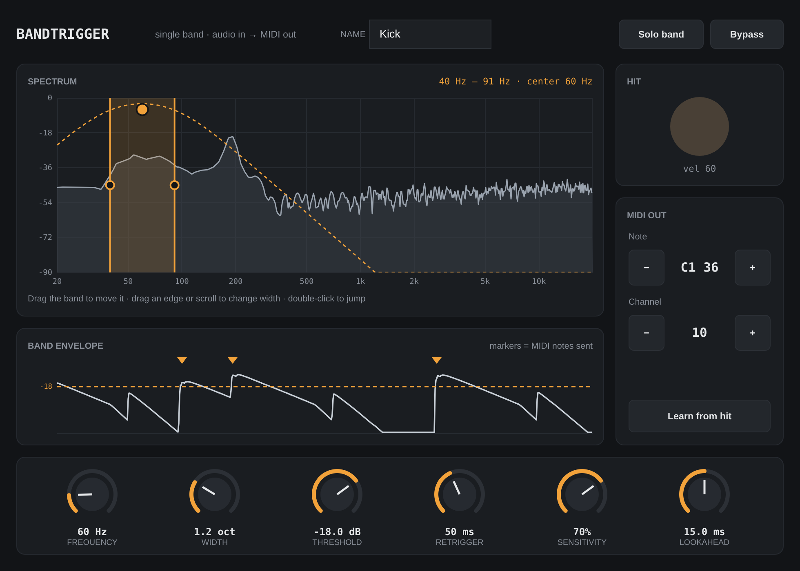

# BandTrigger

Listens to a drum track, watches one frequency band for hits, and sends a MIDI
note for each hit. Use one instance per drum (kick, snare, hats, toms…) and
point the MIDI at a Drum Rack or any sampler.



The project builds **two plug-ins from the same code**:

| Plug-in | Where it goes | Use it in |
|---|---|---|
| **BandTrigger** | Audio effect, inserted on the drum audio track | Reaper, Bitwig, Cubase, Studio One, FL Studio |
| **BandTrigger Instrument** | Instrument on a MIDI track; the drum track feeds it through its sidechain input | Ableton Live |

Formats: VST3 and Standalone on Mac and Windows, plus AU on Mac.

---

## Getting a Mac installer without installing anything

GitHub builds the installer for you on its free Mac machines. Everything
happens in your web browser.

1. Make a free account at [github.com](https://github.com) if you don't have one.
2. Click **+** (top right) → **New repository**. Name it `BandTrigger`, choose
   **Private**, and click **Create repository**.
3. On the new repository's page, click **uploading an existing file**. Unzip
   BandTrigger.zip on your computer, open the `BandTrigger` folder, select
   **everything inside it**, and drag it onto the page. Click **Commit changes**.
   - The `.github` folder is hidden in Finder. Press **Cmd + Shift + .** to
     show hidden files before selecting, or the build won't start.
4. Open the **Actions** tab. "Build Mac installer" starts by itself and takes
   about 15–25 minutes. (If it doesn't start, click it, then **Run workflow**.)
   - If the Actions tab doesn't list "Build Mac installer", the hidden folder
     didn't upload. Click **set up a workflow yourself**, name the file
     `build-mac.yml`, paste in the contents of
     `.github/workflows/build-mac.yml` (open it in TextEdit), and commit.
5. When it shows a green check, click the run and download
   **BandTrigger-mac-installer** under **Artifacts**. Unzip it to get
   `BandTrigger-0.1.0-mac.pkg`.
6. Double-click the .pkg. The first time, macOS will say it can't verify the
   developer, because the installer isn't signed with a paid Apple Developer
   ID. Click **Done**, open **System Settings → Privacy & Security**, scroll
   down, and click **Open Anyway** next to the BandTrigger message.
7. Follow the installer. It puts the plug-ins in
   `/Library/Audio/Plug-Ins/VST3`, and the last page shows the Ableton steps.

Every time you upload changed files, it builds a new installer. On GitHub's
free plan, a **public** repository builds for free with no limit. A
**private** one uses your monthly free minutes, and Mac minutes count extra,
so expect roughly 8–10 builds a month before you hit the cap.

**Signing it properly (optional, later):** with an Apple Developer account
($99/year), add these repository secrets (Settings → Secrets and variables →
Actions) and the installer will open with no warnings: `MAC_CERTS_P12`
(base64 of a .p12 holding your Developer ID Application and Installer
certificates), `MAC_CERTS_PASSWORD`, `MAC_APP_SIGN_IDENTITY`,
`MAC_INSTALLER_SIGN_IDENTITY`, `APPLE_ID`, `APPLE_TEAM_ID` and
`APPLE_APP_PASSWORD` (an app-specific password).

## Building it yourself

You need CMake 3.22+ and a C++17 compiler. JUCE 8.0.4 is downloaded
automatically the first time you configure (about 100 MB).

### Mac

1. Install Xcode's command-line tools: `xcode-select --install`
2. Install CMake: `brew install cmake` (or the installer from cmake.org)
3. From this folder:

```bash
cmake -B build -DCMAKE_BUILD_TYPE=Release
cmake --build build --config Release -j8
```

The plug-ins are copied into `~/Library/Audio/Plug-Ins/VST3` (and `Components`
for AU) automatically. Rescan plug-ins in your DAW. It builds a universal binary
(Apple Silicon and Intel). To make the installer from your own build, run
`./packaging/mac/make_installer.sh build`.

### Windows

1. Install **Visual Studio 2022** (Community is free) with the
   "Desktop development with C++" workload. CMake comes with it.
2. Open "Developer PowerShell for VS 2022", go to this folder, and run:

```powershell
cmake -B build -G "Visual Studio 17 2022"
cmake --build build --config Release
```

3. Copy the two `.vst3` folders from
   `build\BandTrigger_artefacts\Release\VST3\` and
   `build\BandTriggerInst_artefacts\Release\VST3\` into
   `C:\Program Files\Common Files\VST3\`, then rescan in your DAW.

### Tests

`cmake --build build --target EngineTest` builds a detector test that runs a
synthetic drum loop through kick, snare and hi-hat bands and checks hit count
and timing. It needs no JUCE and no DAW.

---

## Setting up in Ableton Live

Live takes MIDI from plug-ins that sit on **MIDI tracks**, so use
**BandTrigger Instrument**:

1. Keep your drum loop on its audio track (call it "Drums").
2. Create a MIDI track and load **BandTrigger Instrument** on it.
3. In the device's title bar, open the **Sidechain** section and set
   Audio From to the "Drums" track. Set the track's Monitor to **In** so it
   keeps processing.
4. Create another MIDI track with your **Drum Rack**. Set its **MIDI From** to
   the BandTrigger track, choose **BandTrigger Instrument** in the second
   dropdown, and set Monitor to **In**.
5. Dial in the band (below). Each hit now plays the Drum Rack.

For more drums, repeat steps 2 to 4: one BandTrigger track per drum, each
feeding its own Drum Rack track. To get everything into one clip, record each
Drum Rack track's MIDI, then drag the clips together onto one track.

Notes:
- Live merges MIDI channels when routing between tracks, so the Channel
  setting doesn't matter in Live. The **Note** does: 36 (C1) is the first Drum
  Rack pad, 38 (D1) is a typical snare, 42 (F#1) a closed hat.
- Worth a quick check: if your version of Live lists the *audio track* as a
  MIDI source when the effect version is on it, you can use plain
  **BandTrigger** directly on the drum track instead, which is simpler.

## Other DAWs

Insert **BandTrigger** on the drum track. The audio passes through unchanged
and the notes come out of the plug-in's MIDI output.

- **Reaper:** the notes flow to the next plug-in in the same FX chain, so add a
  sampler after it, or send the track's MIDI to another track.
- **Bitwig:** route the plug-in's note output to an instrument track
  (Note Receiver, or the track's input chooser).
- **Cubase / Studio One / FL Studio:** pick the plug-in as the MIDI input of an
  instrument track.

**Logic Pro isn't supported yet.** Logic's audio effects can't send MIDI;
that needs a separate MIDI FX version with a sidechain.

---

## Dialing it in

1. **Find the drum.** Click *Learn from hit* and play (or loop) a section
   where the drum hits. It captures the next strong transient and centres the
   band on its loudest frequency. Or drag the band yourself.
2. **Listen.** *Solo band* lets you hear only what the detector hears.
3. **Set the threshold.** Watch *Band envelope*. Each drum hit should poke
   above the dashed line, and bleed from other drums should stay under it.
   The triangles show the notes that were sent.

Good starting bands:

| Drum | Centre | Width | Why |
|---|---|---|---|
| Kick | 50–80 Hz | 1–1.5 oct | Below everything else |
| Snare | 1–3 kHz | 1 oct | The crack. The body (150–250 Hz) overlaps the kick's attack. |
| Hats / cymbals | 8–12 kHz | 1.5 oct | Use a lower threshold; hats are quieter |
| Toms | at each tom's pitch (80–300 Hz) | 0.5–0.8 oct | Narrow bands to separate them |

## Controls

| Control | What it does |
|---|---|
| **Frequency / Width** | Centre and width (in octaves) of the band-pass filter. 24 dB/octave slopes on both sides. Also set by dragging in the spectrum. |
| **Threshold** | Band level a hit must exceed. The hit must fall 3 dB below it before another hit can trigger. |
| **Retrigger** | Minimum time between notes, which stops flams and ringing from double-triggering. |
| **Sensitivity** | 0% = every note at velocity 127. 100% = full dynamics: velocity follows how far the hit peaks above the threshold (30 dB range). |
| **Lookahead** | Delays the audio by this much and reports it to the DAW as latency, so the DAW lines the MIDI up exactly with the hit. 15 ms is enough for kick bands. Set 0 for live playing (notes will be a few ms late, more for low bands). |
| **Note / Channel** | The MIDI note and channel sent. |
| **Solo band** | Outputs only the filtered band. |
| **Bypass** | Passes the audio through and sends no notes. |
| **Name** | A label so you can tell instances apart. Saved with the project. |

## How it works

`Source/TriggerEngine.h` has the whole detector, with no JUCE dependency:

1. The audio is summed to mono and band-passed (two 2nd-order high-passes and
   two 2nd-order low-passes, i.e. Linkwitz-Riley slopes on each side).
2. An envelope follower (0.3 ms attack, 50 ms release) tracks the band level.
3. When the envelope crosses the threshold, a hit starts. The peak over the
   next few ms sets the velocity.
4. Soft hits cross the threshold later than loud ones. To keep timing
   consistent, the engine looks back to where the hit started rising, and it
   also subtracts part of the band filter's own delay (about 4 ms for a 60 Hz
   band, near zero for hats).
5. The note-on is scheduled at exactly that point plus the lookahead, so after
   the DAW's latency compensation it lands on the transient. Tested timing:
   within about 1 ms for kick, snare and hats.

Project layout:

```
CMakeLists.txt          build for both plug-ins
Source/TriggerEngine.h  filter, envelope, detector, MIDI scheduling
Source/PluginProcessor  parameters, audio and MIDI I/O, data for the GUI
Source/PluginEditor     spectrum, envelope view, knobs, steppers, learn
Tests/EngineTest.cpp    detector test on a synthetic drum loop
```

## Ideas for version 2

- **Multi-band:** several bands in one instance, one MIDI output. In Ableton
  that means a single trigger track feeding a single Drum Rack.
- A timing offset knob, and a "learn" that also suggests the threshold.
- A Logic MIDI FX version.
